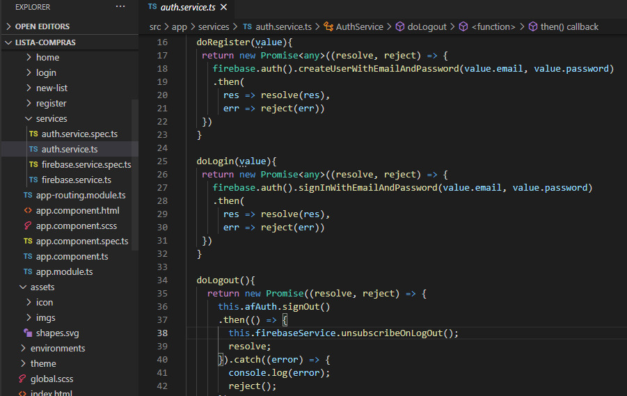
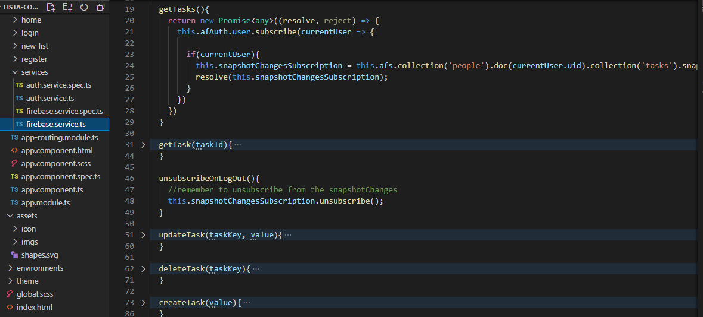
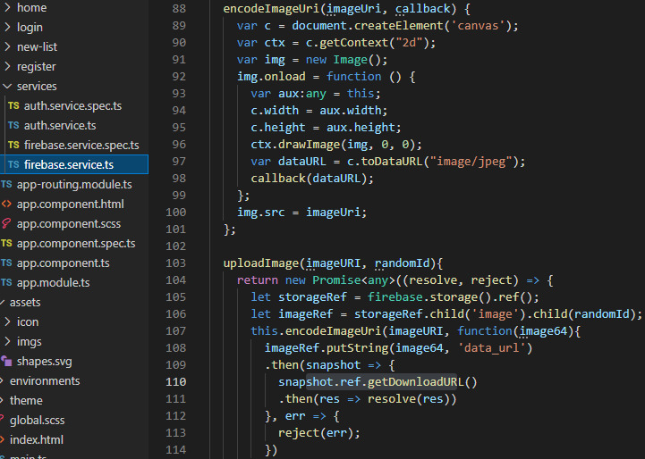
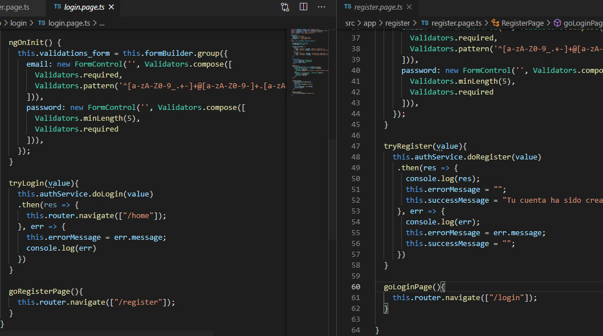
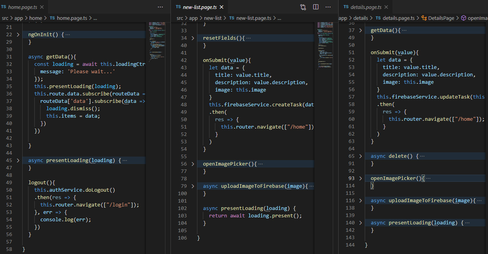

# Proyecto Final Tópicos Especiales
##  Integrantes: Amagua Jhoel - Curipoma David
### Link del video en OneDrive: :movie_camera:
[](https://epnecuador-my.sharepoint.com/:v:/g/personal/jorge_amagua01_epn_edu_ec/ERmef_QkDp9Ls-g1bXL3AecBQLQ2WWl9Pd0BYsd4jUxqqw?e=5exkgi)
 
### En el presente repositorio se encuentra el código del proyecto final realizado para la materia de Tópicos Especiales:

## APP: Mi lista para comprar
```
- Creación de una APP que ayude al usuario en la creación de una lista para compras.
- El usuario podrá registrarse en la APP con un correo y contraseña.
- El usuario podrá crear listas de compras las cuales solo de registran bajo las credenciales de ese usuario.
- El usuario podrá visualuzar sus listas creadas cada que ingrese a la aplicación.
- El usuario podrá acceder a los detalles de cada lista donde podrá eliminar y editar.
- La APK de la aplicación esta firmada y desplegada en Google.
```
## Responsabilidades
| **Mi lista para comprar**|
| ------------- |
| Creación de la base de datos: David Curipoma |
| Creación de los servicios: David Curipoma y Jhoel Amagua |
| Creación de la autenticación: David Curipoma |
| Creación de las páginas: David Curipoma y Jhoel Amagua |
| Creación de las interfaces de visualización: Jhoel Amagua |
| Creación del Icono y Splash Screen: Jhoel Amagua |
| Creación de la APK y firma digital: Jhoel Amagua |
| Carga de la APK a la tienda de aplicaciones: David Curipoma y Jhoel Amagua |
| Creación de video y Readme explicactivos: David Curipoma y Jhoel Amagua |

## Partes Principales del código :wrench:
### Servicios
Se crearon 2 servicios, el auth.service el cuál contiene todo lo relacionado con respecto a la autenticación: funciones resgister, login y logout.
| **auth.service**|
| ------------- |
| |

Y el firebase.service, el cuál contiene todo lo realacionado con respecto al CRUD: funciones create, get, update y delete. Utilizamos snapshotChange el cual permite cargar la información y nos otorga la ID del usuario autenticado en ese momento.
| **firebase.service**|
| ------------- |
| |

También tenemos 2 funciones que nos ayudan en la carga de archivos desde nuestro dispositivo móvil: funciones encodeImage que transforma la URI proveniente de la herramienta imagepicker de cordova y la funcion uploadImage que carga la imagen a nuestra base de datos.
| **firebase.service**|
| ------------- |
| |

### Páginas
Los servicios que se mencionaron anteriormente, se estan utilizando por medio de las páginas: login y register, para el registro y el login de un usuario.
| **Login y Register**|
| ------------- |
| |

Home, newlist y details, donde tenemos todo con respecto al CRUD, en home mostramos toda la lista de ese usuario además de poder salir de su cuenta, el new list esta todo con respecto a la creación de una nueva lista y los permisos para poder cargar una imágen, y por ultimo details donde se encuentra el detalle de esa lista y podra borrar o actualizar la misma. 
| **Login y Register**|
| ------------- |
| |

## Interfaces principales de la APP: :iphone:
### Icono y Splash Screen
Ya que se creó y configuró un icono y un splash screen, al momento de instalar y arrancar la APP, aparecerán estas imágenes.
| **Icono**:radio_button:| **Splash Screen**:speech_balloon:| 
| ------------- | ------------- | 
| | |

| **Inicio de sesión**:bust_in_silhouette: | **Registro**:point_down: |
| :---: | :---: |
| Una vez el usuario tenga una cuenta podrá iniciar sesión con sus credenciales, es importante recordar que las credenciales son el correo y contraseña que hayan sido proporcionados en el registro. El botón de Ingresar no se habilitará hasta que los campos hayan sido llenados correctamente, tanto el tipo de texto como las credenciales correctas. | Si el usuario no tiene una cuenta, tiene que acceder a esta parte, donde se registrará con un correo y una contraseña creada en ese momento,ambos campos tienen que cumplir ciertas reglas para que el registro pueda realizarse de manera correcta. |
|  | |

| **Lista de Compras** :moneybag: | **Nueva Lista**:heavy_plus_sign: | **Detalles** :memo:|
| :---        |     :---     |          :--- |
| Cuando el usuario haya ingresado a su cuenta, le aparecerá sus listas de compras, si ya las hubiese ingresado, caso contrario se muestra un mensaje que indica: Por favor crea tu primera lista, del mismo modo si el usuario tiene listas creadas anteriormente, aparecerán todas con un botón al lado derecho, para ver los detalles de dicha lista. Cada recalcar que las listas solo serán las que el usuario haya registrado y le pertenescan.| Si el usuario acaba de registrarse, tendrá que empezar creando una nueva lista con el título y productos correspondientes, entonces debe ir a la parte superior derecha y acceder al botón +, de esta manera les aparece esta interfaz en la cual pueden agregar una nueva lista. | Cuando el cliente haga clic en VER LISTA, se redirige a esta interfaz, la misma que muestra el título, los productos y dos botones, uno que sirve para guardar los cambios que el usuario pudiera hacer, y el otro para eliminar toda la lista de su listado.|
|  | |  |
||


### Referencias :link:
- https://www.positronx.io/ionic-firebase-authentication-tutorial-with-examples/
- https://github.com/angular/angularfire/blob/master/docs/firestore/collections.md
- https://ionicframework.com/docs/native/image-picker
